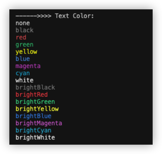
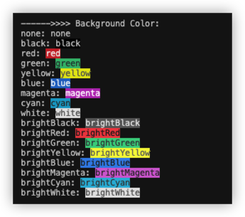
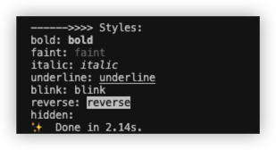
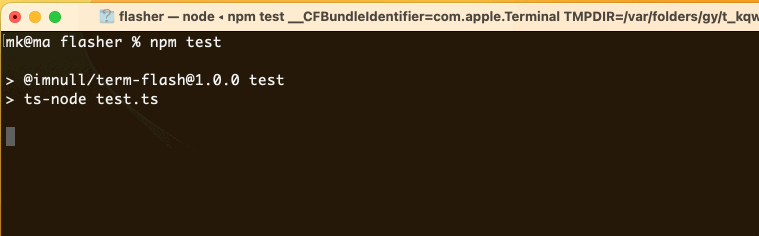
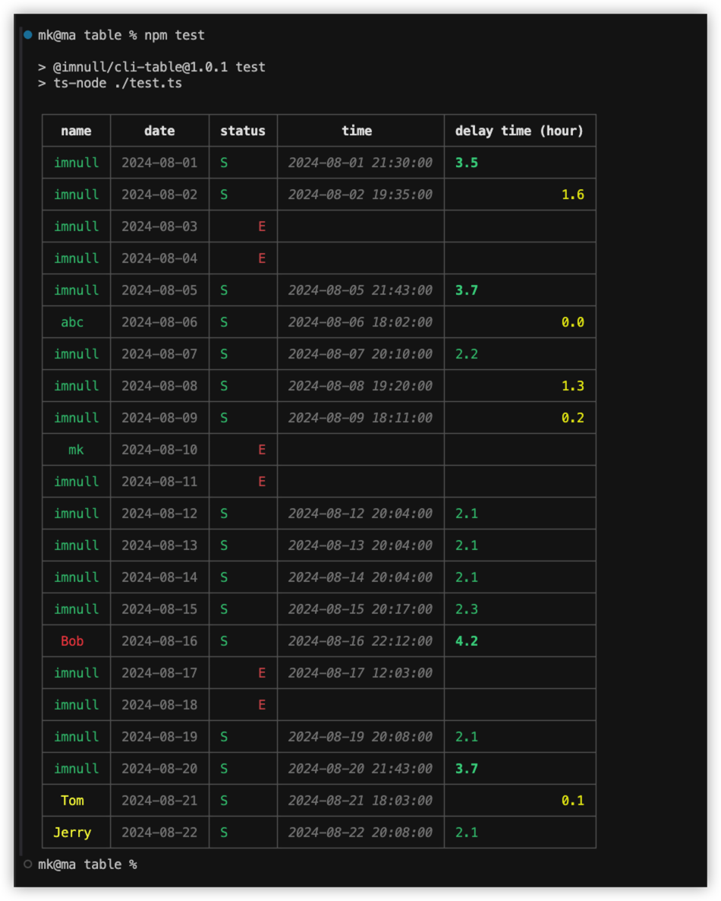

# CLI Tools

一组`CLI`工具，包括：

## @imnull/cli-color 

着色工具：[Source Code](./packages/color)

    ISSUE: 在不通类型的终端下，背景色(background-color)和样式(style)的支持不同，所以表现会有差异。

## @imnull/term-flash 

文本刷新：[Source Code](./packages/flasher)

## @imnull/cli-table 

绘制表格：[Source Code](./packages/table)

    当内容中有中文时，单元格(cell)宽度计算和显示均有问题，尚无解题思路。如使用，请避免使用中文（宽字符）。

